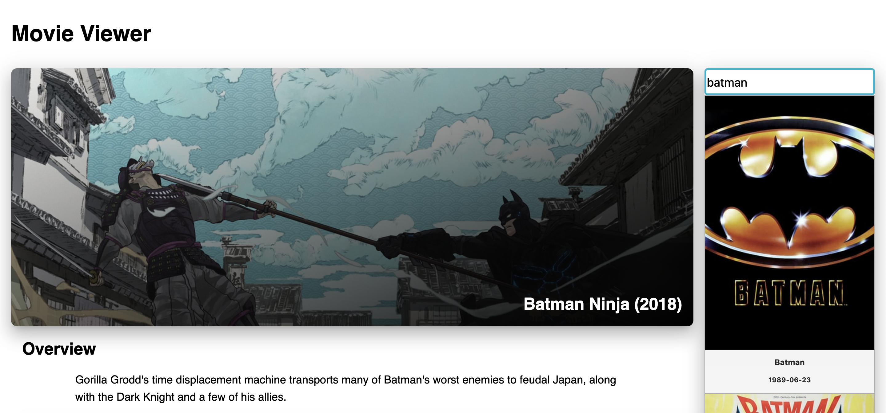
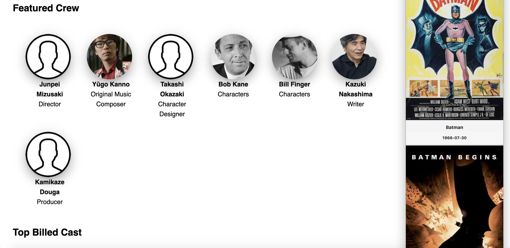
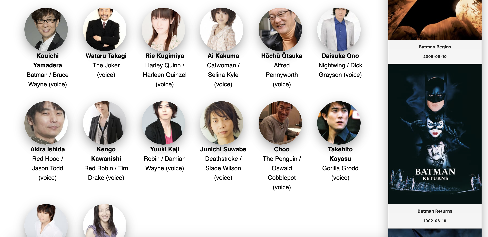

# Movie Viewer

## Problem Description

Take-home test for a React interview

### Task

1. Implement a front-end for a search service that searches through an collection of movie resources. _(retrieved from the movie endpoint)_ and returns a list of matching results.
2. The right pane is where the user would be searching in a Textfield
3. Searching for ‘Batman’ should return any movie with the words Batman on the right pane.
4. Once a movie title is selected on the right it should display the detail page on the left pane.

**See the included mockup** for a sample of what the final result should look like.

Assume the API might be slow.

### API

The root URL of the API is available here: https://clutter-front-end-interview.herokuapp.com. So, to get information about a movie with ID=123, you can go to https://clutter-front-end-interview.herokuapp.com/movies/123.json

There is a movie resource, and castmember resource which belongs to movie, and movie has many cast members.

#### Task Notes

- In the data provided there are two tables `Movie` and `CastMember`, you can access the index for these resources from their respective enpoints `/movies.json` and `/movies/<id>/cast_members.json`. Note that the cast_members.json endpoint doesn't have data for all movies. Some movies with data are 'Spider-Man 3', 'One Flew Over the Cuckoo's Nest', and 'Jason Bourne'. Please also note that some images for cast members may be missing, that is okay.

- The /movies.json endpoint can accept search terms in the following way:
  `/movies.json?q[title_cont]=your-search-term`. the specs/controllers directory has a working example of a search operation.

### Mock up

_note: treat this as a wireframe - feel free to theme it in a modern, professional fashion._

## Problem Solution

### Necessary Changes

The API given in the problem set was not working as expected and would not return results. Therefore, I decided to use [The Movie Database](https://developers.themoviedb.org/3/getting-started/introduction) API to get my results.

Certain layout changes were made under my discretion for modern design.

### Solution Screenshots

This project was bootstrapped with [Create React App](https://github.com/facebook/create-react-app).

I hope you enjoyed❣️
